DHT20产品规格

ASAIR

## DHT20 产品规格书

## 温湿度传感器

• 完全标定

• 数字输出 ，I<sup>2</sup>C接口

• 优异的长期稳定性

• 响应迅速 、抗干扰能力强

• 宽电压支持2.2-5.5VDC

## 产品综述

DHT20是DHT11的全新升级产品，配置了专用的ASIC传感器芯片、高性能的半导体硅基电容式湿度传感器和一个标准的片上温度传感器，并使用了标准I²C数据输出信号格式。其性能已经大大提升，并且超过了前一代传感器（DHT11）的可靠性水平。新一代升级产品，经过改进使其在高温高湿环境下的性能更稳定；同时，产品的精度、响应时间、测量范围都得到了大幅的提升。每一个传感器的出厂都经过严格的校准和测试，保障并满足客户的大规模应用。

## 应用范围

广泛应用于消费电子、医疗、汽车、工业、气象等领域，例如：暖通空调、除湿器和冰箱等家电产品，测试和检测设备及其他相关温湿度检测控制产品。

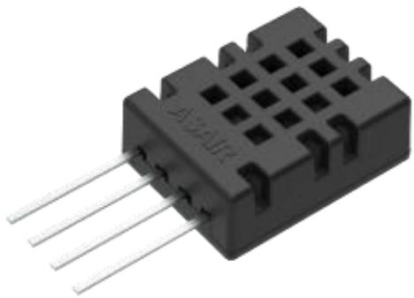


图1. DHT20


1 / 14

www.aosong.com

Version:V1.3—— 2024.09

DHT20产品规格书

ASAIR

## 传感器性能

相对湿度


表1. 湿度特性表


<table><tr><td rowspan=1 colspan=1>参数</td><td rowspan=1 colspan=1>条件</td><td rowspan=1 colspan=1>最小</td><td rowspan=1 colspan=1>典型</td><td rowspan=1 colspan=1>最大</td><td rowspan=1 colspan=1>单位</td></tr><tr><td rowspan=1 colspan=1>分辨率</td><td rowspan=1 colspan=1>典型</td><td rowspan=1 colspan=1>二</td><td rowspan=1 colspan=1>0.024</td><td rowspan=1 colspan=1>二</td><td rowspan=1 colspan=1>%RH</td></tr><tr><td rowspan=2 colspan=1>精度误差1</td><td rowspan=1 colspan=1>典型</td><td rowspan=1 colspan=1>-</td><td rowspan=1 colspan=1>±3</td><td rowspan=1 colspan=1>1</td><td rowspan=1 colspan=1>%RH</td></tr><tr><td rowspan=1 colspan=1>最大</td><td rowspan=1 colspan=2>见图2</td><td rowspan=1 colspan=1>1</td><td rowspan=1 colspan=1>%RH</td></tr><tr><td rowspan=1 colspan=1>重复性</td><td rowspan=1 colspan=1>二</td><td rowspan=1 colspan=1>二</td><td rowspan=1 colspan=1>±0.1</td><td rowspan=1 colspan=1>二</td><td rowspan=1 colspan=1>%RH</td></tr><tr><td rowspan=1 colspan=1>迟滞</td><td rowspan=1 colspan=1>二</td><td rowspan=1 colspan=1>二</td><td rowspan=1 colspan=1>±1</td><td rowspan=1 colspan=1>二</td><td rowspan=1 colspan=1>%RH</td></tr><tr><td rowspan=1 colspan=1>非线性</td><td rowspan=1 colspan=1>二</td><td rowspan=1 colspan=1>-</td><td rowspan=1 colspan=1><0.1</td><td rowspan=1 colspan=1>-</td><td rowspan=1 colspan=1>%RH</td></tr><tr><td rowspan=1 colspan=1>响应时间2</td><td rowspan=1 colspan=1>τ 63%</td><td rowspan=1 colspan=1>二</td><td rowspan=1 colspan=1><8</td><td rowspan=1 colspan=1>二</td><td rowspan=1 colspan=1>S</td></tr><tr><td rowspan=1 colspan=1>工作范围3</td><td rowspan=1 colspan=1>-</td><td rowspan=1 colspan=1>0</td><td rowspan=1 colspan=1>二</td><td rowspan=1 colspan=1>100</td><td rowspan=1 colspan=1>%RH</td></tr><tr><td rowspan=1 colspan=1>长时间漂移4</td><td rowspan=1 colspan=1>正常</td><td rowspan=1 colspan=1>一</td><td rowspan=1 colspan=1><0.5</td><td rowspan=1 colspan=1>一</td><td rowspan=1 colspan=1>%RH/yr</td></tr></table>


图2. 25℃时相对湿度的典型误差和最大误差


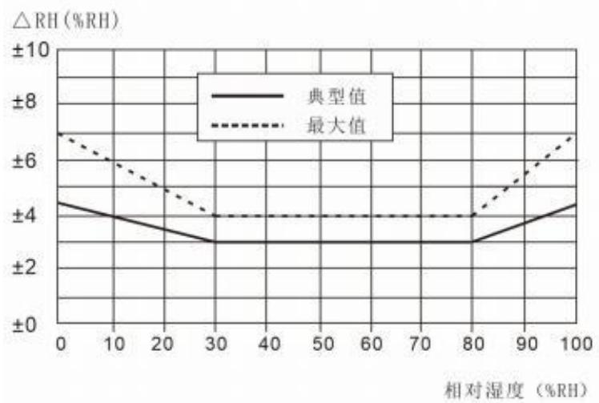

2 / 14

25℃和1m/s气流条件下，达到一阶响应63%所需时间。

<sup>1</sup> 此精度为出厂检验时，传感器在25℃供电电压为3.3V条件下的测试精度。此数值不包括迟滞和非线性，并只适用于非冷凝条件。

<sup>3</sup> 正常工作范围：0-80%RH, 超出此范围，传感器读数会有偏差(在90%RH 湿度下60小时后，会暂时性漂移>3%RH)。工作范围进一步限定在-40 - 80℃。

<sup>4</sup> 如果传感器周围有挥发性溶剂、带刺激性气味的胶带、粘合剂以及包装材料，读数可能会偏移。详细说明请参阅相关文件。

www.aosong.com

Version:V1.3 <sub>——</sub> 2024.09

DHT20产品规格书

ASAIR

温度


表2. 温度特性表


<table><tr><td rowspan=1 colspan=1>参数</td><td rowspan=1 colspan=1>条件</td><td rowspan=1 colspan=1>最小</td><td rowspan=1 colspan=1>典型</td><td rowspan=1 colspan=1>最大</td><td rowspan=1 colspan=1>单位</td></tr><tr><td rowspan=1 colspan=1>分辨率</td><td rowspan=1 colspan=1>典型</td><td rowspan=1 colspan=1>二</td><td rowspan=1 colspan=1>0.01</td><td rowspan=1 colspan=1>一</td><td rowspan=1 colspan=1>℃</td></tr><tr><td rowspan=2 colspan=1>精度误差5</td><td rowspan=1 colspan=1>典型</td><td rowspan=1 colspan=1>一</td><td rowspan=1 colspan=1>±0.5</td><td rowspan=1 colspan=1>二</td><td rowspan=1 colspan=1>℃</td></tr><tr><td rowspan=1 colspan=1>最大</td><td rowspan=1 colspan=2>见图3</td><td rowspan=1 colspan=1>二</td><td rowspan=1 colspan=1>℃</td></tr><tr><td rowspan=1 colspan=1>重复性</td><td rowspan=1 colspan=1>一</td><td rowspan=1 colspan=1>二</td><td rowspan=1 colspan=1>±0.1</td><td rowspan=1 colspan=1>一</td><td rowspan=1 colspan=1>℃</td></tr><tr><td rowspan=1 colspan=1>迟滞</td><td rowspan=1 colspan=1>二</td><td rowspan=1 colspan=1>二</td><td rowspan=1 colspan=1>±0.1</td><td rowspan=1 colspan=1>二</td><td rowspan=1 colspan=1>℃</td></tr><tr><td rowspan=1 colspan=1>响应时间6</td><td rowspan=1 colspan=1>τ 63%</td><td rowspan=1 colspan=1>5</td><td rowspan=1 colspan=1>-</td><td rowspan=1 colspan=1>30</td><td rowspan=1 colspan=1>S</td></tr><tr><td rowspan=1 colspan=1>工作范围</td><td rowspan=1 colspan=1>二</td><td rowspan=1 colspan=1>-40</td><td rowspan=1 colspan=1>二</td><td rowspan=1 colspan=1>80</td><td rowspan=1 colspan=1>℃</td></tr><tr><td rowspan=1 colspan=1>长时间漂移</td><td rowspan=1 colspan=1>一</td><td rowspan=1 colspan=1>一</td><td rowspan=1 colspan=1><0.04</td><td rowspan=1 colspan=1>一</td><td rowspan=1 colspan=1>℃/yr</td></tr></table>


图3. 温度典型误差和最大误差


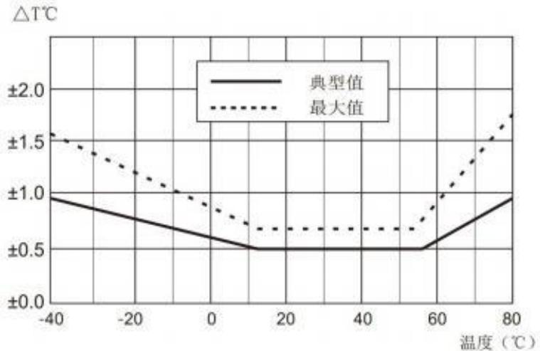


## 电气特性


表3. 电气特性


<table><tr><td rowspan=1 colspan=1>参数</td><td rowspan=1 colspan=1>条件</td><td rowspan=1 colspan=1>最小</td><td rowspan=1 colspan=1>典型</td><td rowspan=1 colspan=1>最大</td><td rowspan=1 colspan=1>单位</td></tr><tr><td rowspan=1 colspan=1>供电电压</td><td rowspan=1 colspan=1>典型</td><td rowspan=1 colspan=1>2.2</td><td rowspan=1 colspan=1>3.3</td><td rowspan=1 colspan=1>5.5</td><td rowspan=1 colspan=1>V</td></tr><tr><td rowspan=2 colspan=1>供电电流, IDD7</td><td rowspan=1 colspan=1>休眠</td><td rowspan=1 colspan=1>一</td><td rowspan=1 colspan=1>250</td><td rowspan=1 colspan=1>一</td><td rowspan=1 colspan=1>nA</td></tr><tr><td rowspan=1 colspan=1>测量</td><td rowspan=1 colspan=1>二</td><td rowspan=1 colspan=1>980</td><td rowspan=1 colspan=1>一</td><td rowspan=1 colspan=1>μA</td></tr><tr><td rowspan=2 colspan=1>功耗8</td><td rowspan=1 colspan=1>休眠</td><td rowspan=1 colspan=1>二</td><td rowspan=1 colspan=1>二</td><td rowspan=1 colspan=1>0.8</td><td rowspan=1 colspan=1>μW</td></tr><tr><td rowspan=1 colspan=1>测量</td><td rowspan=1 colspan=1>二</td><td rowspan=1 colspan=1>3.2</td><td rowspan=1 colspan=1>二</td><td rowspan=1 colspan=1>mW</td></tr><tr><td rowspan=1 colspan=1>通讯</td><td rowspan=1 colspan=5>标准I²C协议</td></tr></table>


3 / 14

<sup>5</sup> 此精度为出厂检验时，传感器在 25℃供电电压为3.3V 条件下的测试精度。 此数值不包括迟滞和非线性，并不适用于冷凝条件。

响应时间取决于传感器基片的导热率。

<sup>7</sup> 供电电流的最小值和最大值都是基于VDD = 3.3V和T<60℃的条件。

功耗的最小值和最大值都是基于VDD = 3.3V和T<60℃的条件。

www.aosong.com

Version:V1.3 <sub>——</sub> 2024.09

DHT20产品规格书

ASAIR

## DHT20用户指南

## 1．扩充性能

## 1.1 工作条件

传感器在所建议工作范围内，性能稳定，见图4。长期暴露在正常范围以外的条件下，尤其是在湿度>80％时，可能导致信号暂时性漂移（60小时后漂移+3%RH） 。当恢复到正常工作条件后，传感器会缓慢自恢复到校正状态 。在非正常条件下的长时间使用，会加速产品的老化。

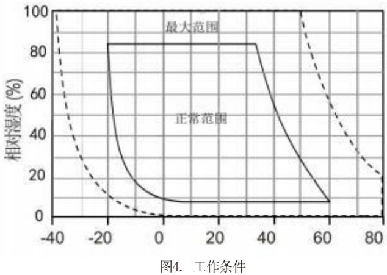


## 1.2 不同温度下的RH精度

图2中定义了 $2 5 \mathrm { { ^ \circ C } }$ 时的RH精度，图5中显示了其他温度段的湿度典型误差。


图5. $\mathrm { 0 \widetilde { \ 8 0 } \mathrm { ‰} }$ 范围内对应的湿度典型误差，单位:(%RH)请注意:以上误差为以高精度露点仪做参考仪器测试的典型误差(不包括迟滞)。


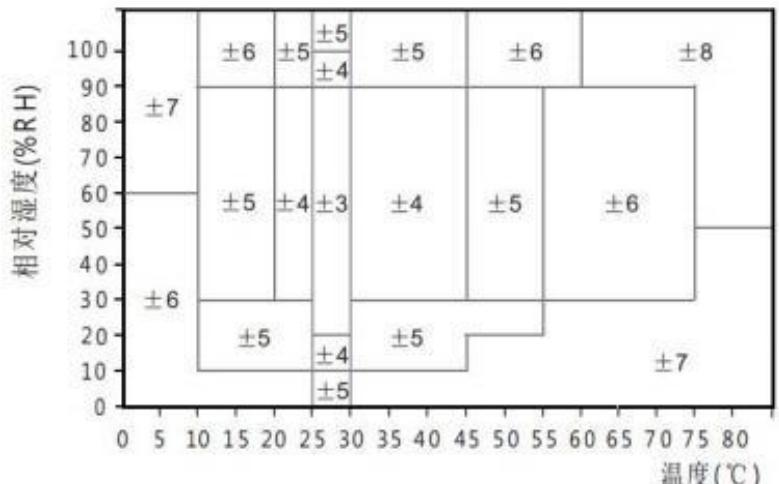


4 / 14

www.aosong.com

Version:V1.3 <sub>——</sub> 2024.09

DHT20产品规格书

ASAIR

温度(℃)

## 1.3 电气特性

表2中给出的功耗与温度和供电电压VDD有关。关于功耗的估测参见图6和7。请注意图6和7中的曲线为典型自然特性，有可能存在偏差。

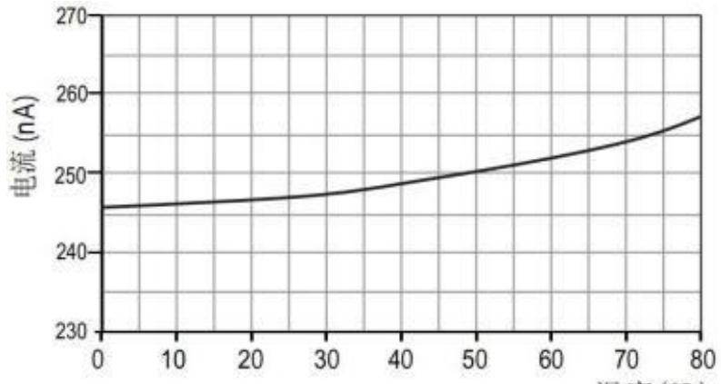


图6.VDD=3.3V时，典型的供电电流与温度的关系曲线（休眠模式）。请注意，这些数据与显示值存在大约±25%偏差


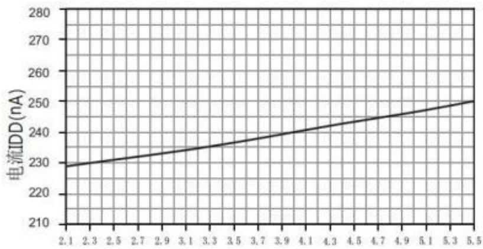


电压 (VDD)


图7.在温度为25℃时，典型的供电电流与供电电压的关系曲线（休眠模式）。


请注意，这些数据与显示值偏差可能会达到显示值的±50%。在60℃时，系数大约为15（与表2相比）


## 2.应用信息

## 2.1 焊接说明

产品禁止使用回流焊或波峰焊进行焊接。手动焊接在最高 $3 0 0 \mathrm { { ‰} }$ 的温度条件下接触必须小于5秒。

请勿将传感器应用于腐蚀性气体中或有冷凝水产生。

## 2.2 存储条件和操作说明

湿度灵敏度等级（MSL）为1，依据IPC/JEDECJ-STD-020标准。因此，建议在出货后一年内使用。

温湿度传感器不是普通的电子元器件，需要仔细防护，这一点用户必须重视。长期暴露在高浓度的化学蒸汽中将会致使传感器的读数产生漂移。因此建议将传感器存放于原包装包括密封的的ESD口袋，并且符合以下条件：温度范围10℃-50℃（在有限时间内0-85℃) ; 湿度为20-60%RH（没有ESD封装的传感器）。对于那些已经被从原包装中移出的传感器，我们建议将它们储存在内含金属PET/AL/CPE材质制成的防静电袋中。

5 / 14

www.aosong.com

Version:V1.3 <sub>——</sub> 2024.09

DHT20产品规格书

ASAIR

在生产和运输过程中，传感器应当避免接触高浓度的化学溶剂和长时间的曝露在外。应当避免接触挥发性的胶水、胶带、贴纸或挥发性的包装材料，如泡箔、泡沫材料等。生产区域应通风良好。

## 2.3 温度影响

气体的相对湿度，在很大程度上依赖于温度。因此在测量湿度时，应尽可能保证所有测量同一湿度的传感器在同一温度下工作。在做测试时，应保证被测试的传感器和参考传感器在同样的温度下，然后比较湿度的读数。

此外，当测量频率过高时，传感器的自身温度会升高而影响测量精度。如果要保证它的自身温升低于0.1℃, DHT20的激活时间不应超过测量时间的10%——建议每2秒钟测量1次数据。

## 2.4 用于密封和封装的材料

许多材质吸收湿气并将充当缓冲器的角色，这会加大响应时间和迟滞。因此传感器周边的材质应谨慎选用。推荐使用的材料有：金属材料，LCP，POM(Delr in)，PTFE(Teflon)，PE，PEEK，PP，PB，PPS，PSU，PVDF，PVF。

用于密封和粘合的材质（保守推荐）：推荐使用充满环氧树脂的方法进行电子元件的封装，或是硅树脂。这些材料释放的气体也有可能污染DHT20(见2.2)。因此，应最后进行传感器的组装，并将其置于通风良好处，或在>50℃的环境中干燥24小时，以使其在封装前将污染气体释放。

## 2.5 布线规则和信号完整性

如果SCL和SDA信号线相互平行并且非常接近，有可能导致信号串扰和通讯失败。解决方法是在两个信号线之间放置VDD或GND，将信号线隔开，和使用屏蔽电缆。此外，降低SCL频率也可能提高信号传输的完整性。见下一章。

6 / 14

15 75%RH可以很简便地由饱和NaCl生成。

www.aosong.com

Version:V1.3 <sub>——</sub> 2024.09

DHT20产品规格书

ASAIR

## 3.接口定义


表4.DHT20 引脚分布（俯视图）


<table><tr><td rowspan=1 colspan=1>引脚</td><td rowspan=1 colspan=1>名称</td><td rowspan=1 colspan=1>释义</td><td rowspan=5 colspan=1>ASAIR1 2 3 4</td></tr><tr><td rowspan=1 colspan=1>1</td><td rowspan=1 colspan=1>VDD</td><td rowspan=1 colspan=1>接电源(2.2-5.5V)</td></tr><tr><td rowspan=1 colspan=1>2</td><td rowspan=1 colspan=1>SDA</td><td rowspan=1 colspan=1>串行数据，双向</td></tr><tr><td rowspan=1 colspan=1>3</td><td rowspan=1 colspan=1>GND</td><td rowspan=1 colspan=1>电源地</td></tr><tr><td rowspan=1 colspan=1>4</td><td rowspan=1 colspan=1>SCL</td><td rowspan=1 colspan=1>串行时钟，双向</td></tr></table>


## 3.1 电源引脚(VDD,GND)

DHT20的供电范围为2.2-5.5V。

## 3.2 串行时钟SCL

SCL用于微处理器与DHT20之间的通讯同步。由于接口包含了完全静态逻辑，因而不存在最小SCL频率。

## 3.3 串行数据SDA

SDA引脚用于传感器的数据输入和输出。当向传感器发送命令时，SDA在串行时钟（SCL）的上升沿有效，且当SCL为高电平时，SDA必须保持稳定。在SCL下降沿之后，SDA值可被改变。为确保通信安全，SDA的有效时间在SCL上升沿之前和下降沿之后应该分别延长至T<sub>SU</sub> and T<sub>HO</sub>-参考图9。当从传感器读取数据时,SDA在SCL变低以后有效(TV)，且维持到下一个SCL的下降沿。

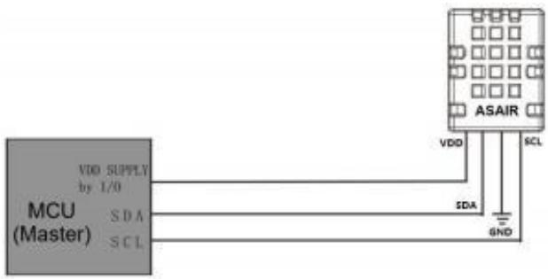


图8.典型的应用电路


为避免信号冲突，微处理器（MCU）必须只能驱动SDA和SCL在低电平。需要一个外部的上拉电阻（例如：4.7kΩ) 将信号提拉至高电平。上拉电阻已包含在DHT20的微处理器的I/O电路中。参考表6和表7可以获取关于传感器输入/输出特性的详细信息。

7 / 14

注 1、产品在电路使用中主机MCU的供电电压必须与传感器一致；

2、如需进一步提高系统的可靠性，可以对传感器电源加以控制。

3、系统刚上电时，优先给传感器VDD供电，5ms后才可以设置SCL和SDA高电平。

www.aosong.com

Version:V1.3 <sub>——</sub> 2024.09

DHT20产品规格书

ASAIR

## 4.电气特性

## 4.1 绝对最大额定值

DHT20的电气特性在表3有所定义。如表5中所给出的绝对最大额定值仅为应力额定值和提供更多的信息。在这样的条件下，该装置进行功能操作是不可取的。长时间暴露于绝对最大额定值条件下，可能影响传感器的可靠性。


表5.电气绝对最大额定值


<table><tr><td rowspan=1 colspan=1>参数</td><td rowspan=1 colspan=1>最小</td><td rowspan=1 colspan=1>最大</td><td rowspan=1 colspan=1>单位</td></tr><tr><td rowspan=1 colspan=1>VDD to GND</td><td rowspan=1 colspan=1>-0.3</td><td rowspan=1 colspan=1>5.5</td><td rowspan=1 colspan=1>V</td></tr><tr><td rowspan=1 colspan=1>数字I/0引脚(SDA, SCL) to GND</td><td rowspan=1 colspan=1>-0.3</td><td rowspan=1 colspan=1>VDD+0.3</td><td rowspan=1 colspan=1>V</td></tr><tr><td rowspan=1 colspan=1>每个引脚的输入电流</td><td rowspan=1 colspan=1>-10</td><td rowspan=1 colspan=1>10</td><td rowspan=1 colspan=1>mA</td></tr></table>


ESD静电释放符合JEDECJESD22-A114标准(人体模式±4kV),JEDECJESD22-A115(机器模式±200V)。如果测试条件超出标称限制指标,传感器需要加额外的保护电路。

## 4.2 输入/输出特性

电气特性，如功耗、输入和输出的高、低电平电压等，依赖于电源供电电压。为了使传感器通讯顺畅，很重要的一点是，确保信号设计严格限制在表6、7和图9所给出的范围内）。


<table><tr><td rowspan=1 colspan=1>参数</td><td rowspan=1 colspan=1>条件</td><td rowspan=1 colspan=1>最小</td><td rowspan=1 colspan=1>典型</td><td rowspan=1 colspan=1>最大</td><td rowspan=1 colspan=1>单位</td></tr><tr><td rowspan=1 colspan=1>输出低电压VOL</td><td rowspan=1 colspan=1><eq>\overline { { \mathsf { V D D } } } = 3 . 3 \mathsf { V } , -</eq><eq>4 \mathsf { m } \mathsf { A } < 1 \mathsf { O L } < 0 \mathsf { m } \mathsf { A }</eq></td><td rowspan=1 colspan=1>0</td><td rowspan=1 colspan=1>1</td><td rowspan=1 colspan=1>0.4</td><td rowspan=1 colspan=1>V</td></tr><tr><td rowspan=1 colspan=1>输出高电压VOH</td><td rowspan=1 colspan=1></td><td rowspan=1 colspan=1>70%VDD</td><td rowspan=1 colspan=1>1</td><td rowspan=1 colspan=1>VDD</td><td rowspan=1 colspan=1>V</td></tr><tr><td rowspan=1 colspan=1>输出汇点电流IOL</td><td rowspan=1 colspan=1></td><td rowspan=1 colspan=1>1</td><td rowspan=1 colspan=1>–</td><td rowspan=1 colspan=1>-4</td><td rowspan=1 colspan=1>mA</td></tr><tr><td rowspan=1 colspan=1>输入低电压VIL</td><td rowspan=1 colspan=1></td><td rowspan=1 colspan=1>0</td><td rowspan=1 colspan=1>1</td><td rowspan=1 colspan=1>30%VDD</td><td rowspan=1 colspan=1>V</td></tr><tr><td rowspan=1 colspan=1>输入高电压VIH</td><td rowspan=1 colspan=1></td><td rowspan=1 colspan=1>70%VDD</td><td rowspan=1 colspan=1>1</td><td rowspan=1 colspan=1>VDD</td><td rowspan=1 colspan=1>V</td></tr><tr><td rowspan=1 colspan=1>输入电流</td><td rowspan=1 colspan=1><eq>\mathsf { \Pi } _ { \mathsf { V I O S . } 5 \mathsf { V } } ^ { \mathsf { V D D = } 5 . 5 \mathsf { V } , \mathsf { V I N = } 0 }</eq></td><td rowspan=1 colspan=1>1</td><td rowspan=1 colspan=1>1</td><td rowspan=1 colspan=1>±1</td><td rowspan=1 colspan=1>uA</td></tr></table>


表 6.数字输入输出焊盘的直流特性，如无特殊声明， $\mathrm { \Delta V D D = 2 . ~ 2 V t o 5 . ~ 5 V , \Delta T = - 4 0 ^ { \circ } ~ \ C t o 8 0 ^ { \circ } }$ C。


图9.数字输入/输出端的时序图、缩略语在表6中进行了解释。较粗的SDA线由传感器控制、普通的SDA线由单片机控制。请注意SDA有效读取时间由前一个转换的下降沿触发。


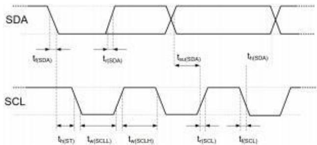


8 / 14

www.aosong.com

Version:V1.3 <sub>——</sub> 2024.09

DHT20产品规格书

ASAIR


<table><tr><td rowspan=2 colspan=1>标号</td><td rowspan=2 colspan=1>参数</td><td rowspan=1 colspan=2>I℃标准模式</td><td rowspan=1 colspan=2>IC 高速模式</td><td rowspan=2 colspan=1>单位</td></tr><tr><td rowspan=1 colspan=1>最小</td><td rowspan=1 colspan=1>最大</td><td rowspan=1 colspan=1>最小</td><td rowspan=1 colspan=1>最大</td></tr><tr><td rowspan=1 colspan=1>f(SCL)</td><td rowspan=1 colspan=1>SCL 时钟频率</td><td rowspan=1 colspan=1>0</td><td rowspan=1 colspan=1>100</td><td rowspan=1 colspan=1>0</td><td rowspan=1 colspan=1>400</td><td rowspan=1 colspan=1>kHz</td></tr><tr><td rowspan=1 colspan=1>tw(SCLL)</td><td rowspan=1 colspan=1>SCL 低电平时间</td><td rowspan=1 colspan=1>4.7</td><td rowspan=1 colspan=1>1</td><td rowspan=1 colspan=1>1.3</td><td rowspan=1 colspan=1>1</td><td rowspan=1 colspan=1>μs</td></tr><tr><td rowspan=1 colspan=1>tw(SCLH)</td><td rowspan=1 colspan=1>SCL 高电平时间</td><td rowspan=1 colspan=1>4.0</td><td rowspan=1 colspan=1>1</td><td rowspan=1 colspan=1>0.6</td><td rowspan=1 colspan=1>1</td><td rowspan=1 colspan=1>μs</td></tr><tr><td rowspan=1 colspan=1>tsu(SDA)</td><td rowspan=1 colspan=1>SDA 启动时间</td><td rowspan=1 colspan=1>250</td><td rowspan=1 colspan=1>1</td><td rowspan=1 colspan=1>100</td><td rowspan=1 colspan=1>1</td><td rowspan=1 colspan=1>ns</td></tr><tr><td rowspan=1 colspan=1>th(SDA)</td><td rowspan=1 colspan=1>SDA 数据保持时间</td><td rowspan=1 colspan=1>0.09</td><td rowspan=1 colspan=1>3.45</td><td rowspan=1 colspan=1>0.02</td><td rowspan=1 colspan=1>0.9</td><td rowspan=1 colspan=1>μs</td></tr><tr><td rowspan=1 colspan=7>注：对于两个引脚的测量都从 0.2 VDD 和 0.8 VDD.注:上述的I2C时序在以下内部延时确定的：(1)内部的SDI输入引脚相对于SCK引脚延时，典型值为100ns(2) 内部的 SDI输出引脚相对于 SCK 下降沿延时， 典型值为 200ns</td></tr></table>


表 7.I<sup>2</sup>C快速模式数字输入/输出端的时序特性。具体含义在图9有所显示，除非另有注明。


## 5.传感器通讯

DHT20采用标准的I2C协议进行通讯。

## 5.1 传感器 $\mathrm { I } ^ { 2 } \mathrm { C }$ 通信协议时序与命令格式

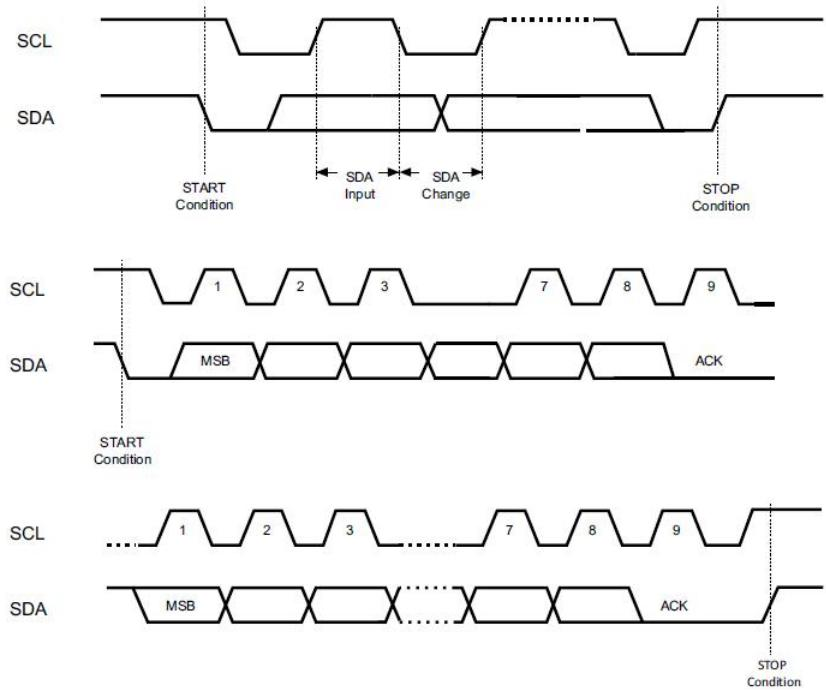


图10.I<sup>2</sup>C总线时序图


13 / 14

www.aosong.com

Version:V1.3 <sub>——</sub> 2024.09

DHT20产品规格书

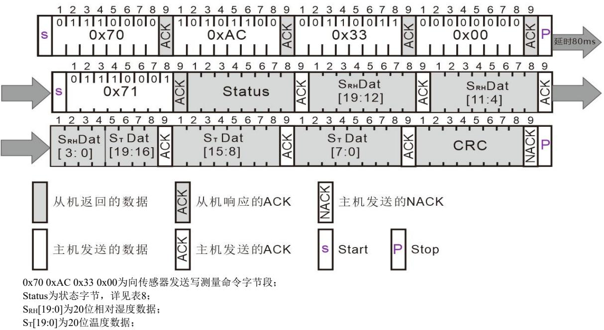


## ASAIR

CRC为校验字节，是对Status、S<sub>RH</sub>[19:0]、S<sub>T</sub>[19:0]进行CRC8校验的结果；


图11.读写数据说明


表8.状态字说明


<table><tr><td rowspan=8 colspan=1>状态字</td><td rowspan=1 colspan=1>比特位</td><td rowspan=1 colspan=1>意义</td><td rowspan=1 colspan=1>描述</td></tr><tr><td rowspan=1 colspan=1>Bit[7]</td><td rowspan=1 colspan=1>忙闲指示(Busy indication)</td><td rowspan=1 colspan=1>1 -- 传感器忙，处于正在进行测量中0 -- 传感器闲，处于休眠状态</td></tr><tr><td rowspan=1 colspan=1>Bit [6:5]</td><td rowspan=1 colspan=1>当前工作模式(Mode Status)</td><td rowspan=1 colspan=1>00 --当前处于 NOR mode01 --当前处于 CYC mode1x --当前处于 CMD mode</td></tr><tr><td rowspan=1 colspan=1>Bit [4]</td><td rowspan=1 colspan=1>CRC_flag</td><td rowspan=1 colspan=1>1-- 表示 OTP 存储器数据完整性测试(CRC)通过0--表示完整性测试失败，表明OTP数据存在错误，</td></tr><tr><td rowspan=1 colspan=1>Bit [3]</td><td rowspan=1 colspan=1>校准计算使能(CalibrationEnable)</td><td rowspan=1 colspan=1>0 -- 校准计算功能被禁用，输出的数据为 ADC 输出的原始数据1 -- 校准计算功能被启用，输出的数据为校准后的数据</td></tr><tr><td rowspan=1 colspan=1>Bit [2]</td><td rowspan=1 colspan=1>CMP 中断</td><td rowspan=1 colspan=1>0 --校准后的电容数据未超出 CMP 中断阈值范围1 --校准后的电容数据超出 CMP 中断阈值范围</td></tr><tr><td rowspan=1 colspan=1>Bit [1]</td><td rowspan=1 colspan=1>Reserved</td><td rowspan=1 colspan=1></td></tr><tr><td rowspan=1 colspan=1>Bit [0]</td><td rowspan=1 colspan=1>Reserved</td><td rowspan=1 colspan=1></td></tr></table>


## 5.2 传感器读取流程

## 1.发送测量命令：

传感器的VDD上电后需等待5ms，发送写测量命令0x70 0xAC 0x33 0x00，等待80ms测量完成；

www.aosong.com

Version:V1.3 <sub>——</sub> 2024.09

13 / 14

DHT20产品规格书

ASAIR

## 2.获取温湿度校准数据：

在等待80ms测量完成后，发送0x71读传感器，可获取状态字Status、温湿度校准数据S<sub>RH</sub>[19:0]、S<sub>T</sub>[19:0]以及校准字CRC；如图18.读写数据说明，状态字描述如表8；

## 3.CRC校验：

将测量读取到的Status、S<sub>RH</sub>[19:0]、S<sub>T</sub>[19:0]进行CRC8检验，CRC初始值为0xFF，CRC8校验多项式为： $\operatorname { C R C } [ 7 : 0 ] = 1 + \mathbf { x } ^ { 4 } + \mathbf { x } ^ { 5 } + \mathbf { x } ^ { 8 } ,$ , CRC计算代码如下：

```scss
//**********************************************************//
```

```c
//CRC校验类型：CRC8
//多项式：X8+X5+X4+1
//Poly:0011 0001 0x31
unsigned char Calc_CRC8(unsigned char *message,unsigned char Num)
{
unsigned char i;
unsigned char byte;
unsigned char crc =0xFF;
for (byte = 0;byte<Num;byte++)
{
crc^=(message[byte]);
for(i=8;i>0;--i)
{
if(crc&0x80)
crc=(crc<<1)^0x31;
else
crc=(crc<<1);
}
}
Return crc;
}
//**********************************************************//
```

4.计算温湿度值：

相对湿度转换公式：

$$
R H ( \% ) = ( \frac { S _ { R H } } { 2 ^ { 2 0 } } ) \times 1 0 0 \%
$$

温度转换公式：

$$
T [ \mathrm { { C } ] } = \left( \frac { \mathsf { S } _ { \tau } } { 2 ^ { \circ } } \right) \star 2 0 0 { - } 5 0
$$

$$
\begin{array} { r } { \overline { { \mathtt { J } } } _ { \mathtt { N } } ^ { \mathtt { e } } | \beta | : \ \mathcal { S } _ { \mathtt { T } } : \ 0 \times 2 \mathsf { F } \mathsf { F } \mathsf { A } \mathsf { B } , \quad \frac { \mathtt { j } _ { \mathtt { k } } \mathtt { k } + \mathtt { k } \mathtt { k } \mathtt { m } _ { \mathtt { N } } ^ { \mathtt { i } } } { 4 \pi \sqrt { \mathtt { N } } } \frac { \mathtt { j } _ { \mathtt { k } } } { \mathtt { j } } + \frac { \mathtt { j } _ { \mathtt { k } } \mathtt { k } \mathtt { m } _ { \mathtt { N } } ^ { \mathtt { i } } } { 2 \pi \sqrt { \mathtt { j } } } | \beta | \leqslant 5 2 3 , \mathsf { T } = ( 1 9 6 5 2 3 / 1 0 4 8 5 7 6 ) ^ { \star } 2 0 0 - 5 0 = - 1 2 . 5 ^ { \circ } \mathsf { C } } \end{array}
$$

注：传感器在采集时需要时间，主机发出测量命令（0xAC，0x33，0x00）后，未延时80ms则状态字Bit7可能为1，此时读到的为前一次测量命令的温湿度数据，传感器在测量完成后会进入休眠状态直到下一次通信时唤醒。

## 6.环境稳定性

如果传感器用于装备或机械中，要确保用于测量的传感器与用于参考的传感器感知的是同一条件的温度和湿度。如果传感器被放置于装备中，反应时间会延长，因此在程序设计中要保证预留足够的测量时间。DHT20传感器依据奥松温湿度传感器企业标准进行测试。传感器在其它测试条件下的表现，我们不予保证，且不能作为传感器性能的一部分。尤其是对用户要求的特定场合，不做任何承诺。

13 / 14

www.aosong.com

Version:V1.3 <sub>——</sub> 2024.09

DHT20产品规格书

ASAIR

## 7.包装

## 7.1 产品尺寸

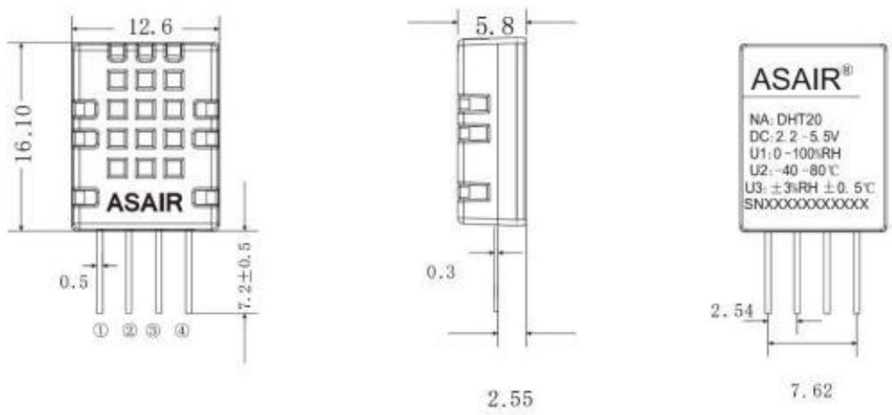


图12.DHT20传感器封装图（单位：mm，未标明公差：0.2mm）


## 7.2 追踪信息

所有的DHT20传感器背面都带有激光标识。参见图12。

防静电袋上面也贴有标签,如图13,并提供了其他的跟踪信息。

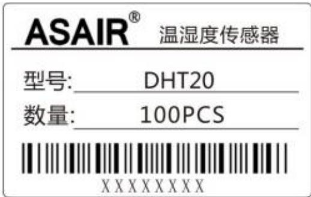


图13.防静电袋上的标签


## 7.3 运输包装

DHT20采用托盘式包装，每个吸塑盘包装50个传感器，每两个吸塑盒密封在一个防静电屏蔽袋中，共100个传感器。

带有传感器定位的包装图如图14所示。吸塑盒放置在防静电屏蔽袋中。

13 / 14

www.aosong.com

Version:V1.3 <sub>——</sub> 2024.09

DHT20产品规格书

ASAIR

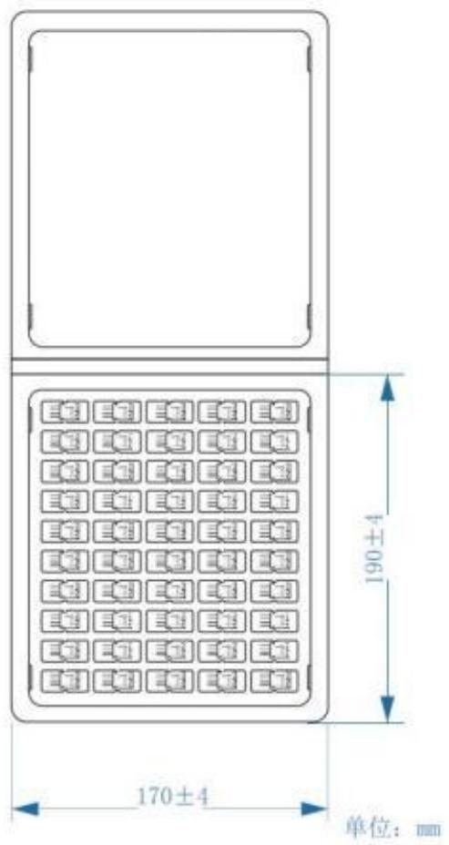


图14.吸塑盒和传感器定位图


<table><tr><td rowspan=1 colspan=1>DHT20包装</td><td rowspan=1 colspan=1>数量</td><td rowspan=1 colspan=1>总重量</td></tr><tr><td rowspan=1 colspan=1>单个传感器</td><td rowspan=1 colspan=1>1pcs</td><td rowspan=1 colspan=1>约0.9g</td></tr><tr><td rowspan=1 colspan=1>每盘传感器</td><td rowspan=1 colspan=1>50pcs</td><td rowspan=1 colspan=1>约70g</td></tr><tr><td rowspan=1 colspan=1>每袋传感器</td><td rowspan=1 colspan=1>2盘/100pcs</td><td rowspan=1 colspan=1>约145g</td></tr></table>


13 / 14

www.aosong.com

Version:V1.3 <sub>——</sub> 2024.09

DHT20产品规格书

ASAIR

## 注意事项

## 警告,人身伤害

勿将本产品应用于安全保护装置或急停设备上，以及由于该产品故障可能导致人身伤害的任何其它应用中。不得应用本产品除非有特别的目的或有使用授权。在安装、处理、使用或维护该产品前要参考产品数据表及应用指南。如不遵从此建议，可能导致死亡和严重的人身伤害。

如果买方将要购买或使用奥松的产品而未获得任何应用许可及授权，买方将承担由此产生的人身伤害及死亡的所有赔偿，并且免除由此对奥松公司管理者和雇员以及附属子公司、代理商、分销商等可能产生的任何索赔要求，包括：各种成本费用、赔偿费用、律师费用等等。

## ESD 防护

由于元件的固有设计，导致其对静电的敏感性。为防止静电导入的伤害或者降低产品性能，在应用本产品时，请采取必要的防静电措施。

## 品质保证

本公司对其产品的直接购买者提供为期12个月（1年）的质量保证（自发货之日起计算），以奥松出版的该产品的数据手册中的技术规格为标准。如果在保质期内，产品被证实有缺陷，本公司将提供免费的维修或更换。用户需满足下述条件：

• 该产品在发现缺陷14天内书面通知本公司；

• 该产品缺陷有助于发现本公司的设计、材料、工艺上的不足；

• 该产品应由购买者付费寄回到本公司；

• 该产品应在保质期内。

本公司只对那些应用在符合该产品技术条件的场合而产生缺陷的产品负责。本公司对其产品应用在那些特殊的应用场合不做任何的保证、担保或是书面陈述。同时本公司对其产品应用到产品或是电路中的可靠性也不做任何承诺。

本手册如有更改，恕不另行通知。

本产品最终解释权归广州奥松电子股份有限公司所有。

版权所有 ©2024，ASAIR®

14 / 14

www.aosong.com

Version:V1.3 <sub>——</sub> 2024.09