<table><tr><td rowspan="2">Shenzhen P&O Technology Co.,Limited</td><td>Rev No</td><td>Issued Date.</td><td>Page</td></tr><tr><td>A</td><td>2021.10.7</td><td>1/12</td></tr></table>

<table><tr><td rowspan=1 colspan=1>Project Size.</td><td rowspan=1 colspan=3>1.69 inch</td></tr><tr><td rowspan=1 colspan=1>Model No.</td><td rowspan=1 colspan=3>P169H002-CTP</td></tr><tr><td rowspan=1 colspan=1>Samples No.</td><td rowspan=1 colspan=3></td></tr><tr><td rowspan=1 colspan=1>Product type.</td><td rowspan=1 colspan=3>240xRGBx280SPI mode</td></tr><tr><td rowspan=1 colspan=4>Signature by customer:</td></tr><tr><td rowspan=1 colspan=2>Prepared</td><td rowspan=1 colspan=1>Checked</td><td rowspan=1 colspan=1>Approved</td></tr><tr><td rowspan=1 colspan=2></td><td rowspan=1 colspan=1></td><td rowspan=1 colspan=1></td></tr></table>

## Shenzhen P&O Technology Co.,Limited

Email: polcd@polcd.com

Mobile: 86-137 1538 6666

<table><tr><td rowspan="2">Shenzhen P&O Technology Co.,Limited</td><td>Rev No</td><td>Issued Date.</td><td>Page</td></tr><tr><td>A</td><td>2021.10.7</td><td>2/12</td></tr></table>

## 1.0 GENERAL DESCRIPTION

<table><tr><td rowspan=1 colspan=1>Item</td><td rowspan=1 colspan=1>Specification</td><td rowspan=1 colspan=1>Unit</td></tr><tr><td rowspan=1 colspan=1>Screen Size</td><td rowspan=1 colspan=1>1.69 inch</td><td rowspan=1 colspan=1>Diagonal</td></tr><tr><td rowspan=1 colspan=1>Number of Pixel</td><td rowspan=1 colspan=1>240RGB(H)x280(V)</td><td rowspan=1 colspan=1>Pixels</td></tr><tr><td rowspan=1 colspan=1>Display area</td><td rowspan=1 colspan=1>27.97(H)x32.63(V)</td><td rowspan=1 colspan=1>mm</td></tr><tr><td rowspan=1 colspan=1>Pixel pitch</td><td rowspan=1 colspan=1>0.11655(H)x0.11655(V)</td><td rowspan=1 colspan=1>mm</td></tr><tr><td rowspan=1 colspan=1>Outline Dimension</td><td rowspan=1 colspan=1>33.13x41.13x3.8</td><td rowspan=1 colspan=1>mm</td></tr><tr><td rowspan=1 colspan=1>Pixel arrangement</td><td rowspan=1 colspan=1>RGB Vertical Stripe</td><td rowspan=1 colspan=1></td></tr><tr><td rowspan=1 colspan=1>Display mode</td><td rowspan=1 colspan=1>Normally Black</td><td rowspan=1 colspan=1></td></tr><tr><td rowspan=1 colspan=1>Viewing Direction(eye)</td><td rowspan=1 colspan=1>ALL</td><td rowspan=1 colspan=1></td></tr><tr><td rowspan=1 colspan=1>Gray inversion direction</td><td rowspan=1 colspan=1>--</td><td rowspan=1 colspan=1></td></tr><tr><td rowspan=1 colspan=1>Display Color</td><td rowspan=1 colspan=1>262K</td><td rowspan=1 colspan=1></td></tr><tr><td rowspan=1 colspan=1>Luminance(cd/m²)</td><td rowspan=1 colspan=1>500</td><td rowspan=1 colspan=1>nit</td></tr><tr><td rowspan=1 colspan=1>Contrast Ratio</td><td rowspan=1 colspan=1>1000:1</td><td rowspan=1 colspan=1></td></tr><tr><td rowspan=1 colspan=1>Surface treatment</td><td rowspan=1 colspan=1></td><td rowspan=1 colspan=1></td></tr><tr><td rowspan=1 colspan=1>Interface</td><td rowspan=1 colspan=1>4-line SPI</td><td rowspan=1 colspan=1></td></tr><tr><td rowspan=1 colspan=1>Back-light</td><td rowspan=1 colspan=1>LED Side-light type</td><td rowspan=1 colspan=1></td></tr><tr><td rowspan=1 colspan=1>Drive IC</td><td rowspan=1 colspan=1>ST7789T3</td><td rowspan=1 colspan=1></td></tr><tr><td rowspan=1 colspan=1>Operation Temperature</td><td rowspan=1 colspan=1>-20~70</td><td rowspan=1 colspan=1>℃</td></tr><tr><td rowspan=1 colspan=1>Storage Temperature</td><td rowspan=1 colspan=1>-30~80</td><td rowspan=1 colspan=1>℃</td></tr><tr><td rowspan=1 colspan=1>Weight</td><td rowspan=1 colspan=1></td><td rowspan=1 colspan=1>g</td></tr></table>

## 1.1 Features

n 4-line SPI parallel interface.

## 1.2 Applications

n MPOS Device.

n Personal Navigation Device.

n Other devices which require high quality displays.

<table><tr><td rowspan="2">Shenzhen P&O Technology Co.,Limited</td><td>Rev No</td><td>Issued Date.</td><td>Page</td></tr><tr><td>A</td><td>2021.10.7</td><td>3/12</td></tr></table>

## 2.0 INPUT INTERFACE PIN ASSIGNMENT

FPC connector is used for electronics interface.

<table><tr><td rowspan=1 colspan=1>PinNo.</td><td rowspan=1 colspan=1>Symbol</td><td rowspan=1 colspan=1>Function</td></tr><tr><td rowspan=1 colspan=1>1</td><td rowspan=1 colspan=1>GND</td><td rowspan=1 colspan=1>Ground</td></tr><tr><td rowspan=1 colspan=1>2</td><td rowspan=1 colspan=1>LEDK</td><td rowspan=1 colspan=1>LED back light(Cathode)</td></tr><tr><td rowspan=1 colspan=1>3</td><td rowspan=1 colspan=1>VDD</td><td rowspan=1 colspan=1>Power Supply</td></tr><tr><td rowspan=1 colspan=1>4</td><td rowspan=1 colspan=1>VDDIO</td><td rowspan=1 colspan=1>Power Supply</td></tr><tr><td rowspan=1 colspan=1>5-6</td><td rowspan=1 colspan=1>GND</td><td rowspan=1 colspan=1>Ground</td></tr><tr><td rowspan=1 colspan=1>7</td><td rowspan=1 colspan=1>D/C</td><td rowspan=1 colspan=1>Display data/command selection pin in parallel</td></tr><tr><td rowspan=1 colspan=1>8</td><td rowspan=1 colspan=1>CS</td><td rowspan=1 colspan=1>Chip select input pin</td></tr><tr><td rowspan=1 colspan=1>9</td><td rowspan=1 colspan=1>SCL</td><td rowspan=1 colspan=1>Serial interface clock</td></tr><tr><td rowspan=1 colspan=1>10</td><td rowspan=1 colspan=1>SDA</td><td rowspan=1 colspan=1>SPI interface input/output pin</td></tr><tr><td rowspan=1 colspan=1>11</td><td rowspan=1 colspan=1>RESET</td><td rowspan=1 colspan=1>External reset input.</td></tr><tr><td rowspan=1 colspan=1>12</td><td rowspan=1 colspan=1>GND</td><td rowspan=1 colspan=1>Ground</td></tr><tr><td rowspan=1 colspan=1>13</td><td rowspan=1 colspan=1>TP_SCL</td><td rowspan=1 colspan=1>Touch screen clock signal</td></tr><tr><td rowspan=1 colspan=1>14</td><td rowspan=1 colspan=1>TP_SDA</td><td rowspan=1 colspan=1>Touch data input/output bidirectional pins</td></tr><tr><td rowspan=1 colspan=1>15</td><td rowspan=1 colspan=1>TP_TRST</td><td rowspan=1 colspan=1>Touch screen reset signal</td></tr><tr><td rowspan=1 colspan=1>16</td><td rowspan=1 colspan=1>TP_TINT</td><td rowspan=1 colspan=1>Touch screen interrupt signa</td></tr><tr><td rowspan=1 colspan=1>17</td><td rowspan=1 colspan=1>VDD</td><td rowspan=1 colspan=1>Touch screen power supply</td></tr><tr><td rowspan=1 colspan=1>18</td><td rowspan=1 colspan=1>GND</td><td rowspan=1 colspan=1>Ground</td></tr></table>

<table><tr><td rowspan="2">Shenzhen P&O Technology Co.,Limited</td><td>Rev No</td><td>Issued Date.</td><td>Page</td></tr><tr><td>A</td><td>2021.10.7</td><td>4/12</td></tr></table>

## 3.0 OPTICAL CHARACTERISTICS

## 3.1 Optical specification

<table><tr><td rowspan=1 colspan=2>Item</td><td rowspan=1 colspan=1>Symbol</td><td rowspan=1 colspan=1>Condition</td><td rowspan=1 colspan=1>Min</td><td rowspan=1 colspan=1>Type</td><td rowspan=1 colspan=1>Max</td><td rowspan=1 colspan=1>Unit</td><td rowspan=1 colspan=1>Note</td></tr><tr><td rowspan=1 colspan=2>White luminance(Center)</td><td rowspan=1 colspan=1>Lv</td><td rowspan=3 colspan=1>Θ=0NormalViewing</td><td rowspan=1 colspan=1>--</td><td rowspan=1 colspan=1>500</td><td rowspan=1 colspan=1>--</td><td rowspan=1 colspan=1>cd/m²</td><td rowspan=1 colspan=1>(4)(5)(7)</td></tr><tr><td rowspan=1 colspan=2>Response time</td><td rowspan=1 colspan=1>Tr+Tf</td><td rowspan=1 colspan=1>--</td><td rowspan=1 colspan=1>35</td><td rowspan=1 colspan=1>45</td><td rowspan=1 colspan=1>ms</td><td rowspan=1 colspan=1>(3)</td></tr><tr><td rowspan=1 colspan=2>Contrast ratio</td><td rowspan=1 colspan=1>CR</td><td rowspan=1 colspan=1>800</td><td rowspan=1 colspan=1>1000</td><td rowspan=1 colspan=1>--</td><td rowspan=1 colspan=1>--</td><td rowspan=1 colspan=1>(2)(4)</td></tr><tr><td rowspan=2 colspan=1>ColorChromaticity(CIE1931)</td><td rowspan=2 colspan=1>white</td><td rowspan=1 colspan=1>Wx</td><td rowspan=2 colspan=1>AngleIBL=60mA</td><td rowspan=1 colspan=1>--</td><td rowspan=1 colspan=1>0.323</td><td rowspan=1 colspan=1>--</td><td rowspan=2 colspan=1></td><td rowspan=2 colspan=1>(6)</td></tr><tr><td rowspan=1 colspan=1>Wy</td><td rowspan=1 colspan=1>--</td><td rowspan=1 colspan=1>0.347</td><td rowspan=1 colspan=1>--</td></tr><tr><td rowspan=4 colspan=1>Viewing Angle</td><td rowspan=2 colspan=1>Hor</td><td rowspan=1 colspan=1>OL</td><td rowspan=4 colspan=1>CR≥10</td><td rowspan=1 colspan=1>70</td><td rowspan=1 colspan=1>80</td><td rowspan=1 colspan=1>--</td><td rowspan=4 colspan=1></td><td rowspan=4 colspan=1>(1)</td></tr><tr><td rowspan=1 colspan=1>OR</td><td rowspan=1 colspan=1>70</td><td rowspan=1 colspan=1>80</td><td rowspan=1 colspan=1>--</td></tr><tr><td rowspan=2 colspan=1>Ver</td><td rowspan=1 colspan=1>OU</td><td rowspan=1 colspan=1>70</td><td rowspan=1 colspan=1>80</td><td rowspan=1 colspan=1>--</td></tr><tr><td rowspan=1 colspan=1>OD</td><td rowspan=1 colspan=1>70</td><td rowspan=1 colspan=1>80</td><td rowspan=1 colspan=1>--</td></tr><tr><td rowspan=1 colspan=2>Brightness uniformity</td><td rowspan=1 colspan=1>Avg</td><td rowspan=1 colspan=1>Θ=0</td><td rowspan=1 colspan=1>80</td><td rowspan=1 colspan=1>90</td><td rowspan=1 colspan=1>--</td><td rowspan=1 colspan=1>%</td><td rowspan=1 colspan=1>(5)</td></tr><tr><td rowspan=1 colspan=2>Color Gamut</td><td rowspan=1 colspan=1>NTSC</td><td rowspan=1 colspan=1>Θ=0</td><td rowspan=1 colspan=1>--</td><td rowspan=1 colspan=1>70</td><td rowspan=1 colspan=1>--</td><td rowspan=1 colspan=1>%</td><td rowspan=1 colspan=1>(6)</td></tr><tr><td rowspan=1 colspan=2>Optima View Direction</td><td rowspan=1 colspan=6>ALL</td><td rowspan=1 colspan=1>(1)</td></tr></table>

3.2 Measuring Condition

n Measuring surrounding: dark room

n LED current IL: 60mA

n Ambient temperature: $2 5 { \pm } 2 \mathrm { \bar { C } }$

n 15min. warm-up time

## 3.3 Measuring Equipment

n BM-7

n Measuring spot size：30 \~ 31 mm

<table><tr><td rowspan="2">Shenzhen P&O Technology Co.,Limited</td><td>Rev No</td><td>Issued Date.</td><td>Page</td></tr><tr><td>A</td><td>2021.10.7</td><td>5/12</td></tr></table>

Note (1) Definition of Viewing Angle

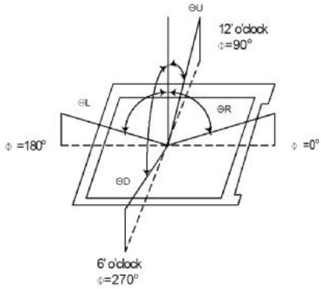

Note (2) Definition of Contrast Ratio(CR): Measured at the center point of panel

Luminance with all pixels white CR= Luminance with all pixels black

Note (3) Definition of Response Time: Sum of TR and TF

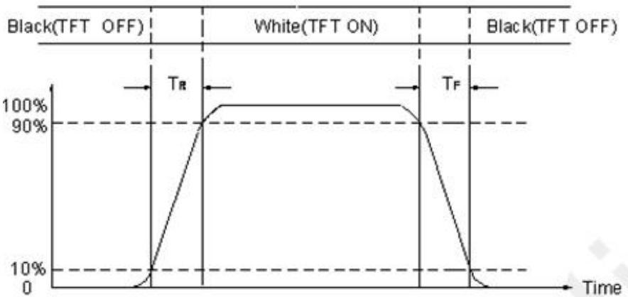

Note (4) Definition of optical measurement setup

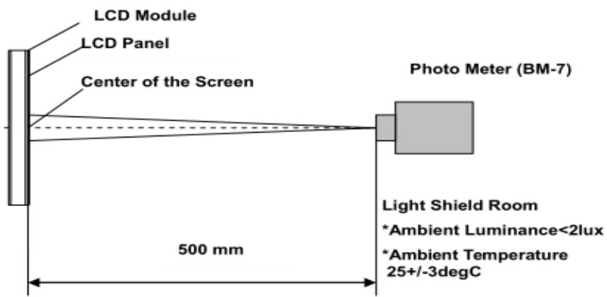

<table><tr><td rowspan="2">Shenzhen P&O Technology Co.,Limited</td><td>Rev No</td><td>Issued Date.</td><td>Page</td></tr><tr><td>A</td><td>2021.10.7</td><td>6/12</td></tr></table>

Note (5) Definition of brightness uniformity The luminance uniformity is calculated by using following formula. △Bp = Bp (Min.) / Bp (Max.)×100 (%) Bp (Max.) = Maximum brightness in 9 measured spots Bp (Min.) = Minimum brightness in 9 measured spots .

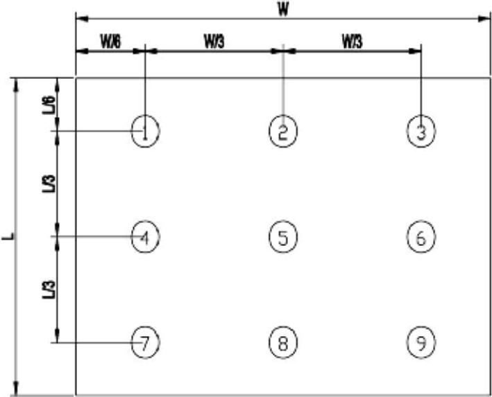

Note (6) Definition of Color of CIE1931 Coordinate and NTSC Ratio. Color gamut:

Note (7) Measured the luminance of white state at center point.

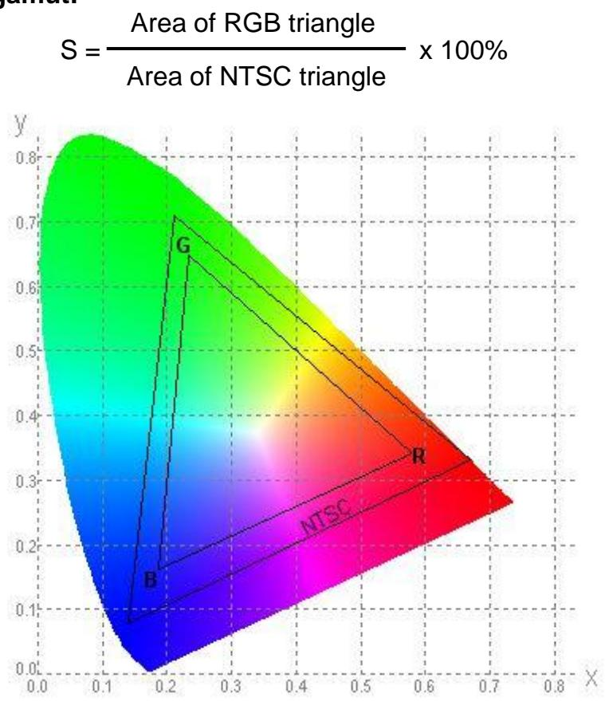

<table><tr><td rowspan="2">Shenzhen P&O Technology Co.,Limited</td><td>Rev No</td><td>Issued Date.</td><td>Page</td></tr><tr><td>A</td><td>2021.10.7</td><td>7/12</td></tr></table>

## 4.0 ELECTRICAL CHARACTERISTICS

## 4.1 TFT LCD Module

<table><tr><td rowspan=1 colspan=1>Item</td><td rowspan=1 colspan=1>Symbol</td><td rowspan=1 colspan=1>Min.</td><td rowspan=1 colspan=1>Typ.</td><td rowspan=1 colspan=1>Max.</td><td rowspan=1 colspan=1>Unit</td><td rowspan=1 colspan=1>Remark</td></tr><tr><td rowspan=1 colspan=1>Analog supply voltage</td><td rowspan=1 colspan=1>VDD</td><td rowspan=1 colspan=1>2.65</td><td rowspan=1 colspan=1>2.8</td><td rowspan=1 colspan=1>3.2</td><td rowspan=1 colspan=1>V</td><td rowspan=1 colspan=1></td></tr><tr><td rowspan=1 colspan=1>Digital supply voltage</td><td rowspan=1 colspan=1>VDDI</td><td rowspan=1 colspan=1>1.65</td><td rowspan=1 colspan=1>1.8</td><td rowspan=1 colspan=1>3.3</td><td rowspan=1 colspan=1></td><td rowspan=1 colspan=1></td></tr><tr><td rowspan=2 colspan=1>Input signal Voltage</td><td rowspan=1 colspan=1>VIH</td><td rowspan=1 colspan=1>0.7VDDI</td><td rowspan=1 colspan=1>-</td><td rowspan=1 colspan=1>VDDI</td><td rowspan=1 colspan=1>V</td><td rowspan=1 colspan=1></td></tr><tr><td rowspan=1 colspan=1>VIL</td><td rowspan=1 colspan=1>GND</td><td rowspan=1 colspan=1>-</td><td rowspan=1 colspan=1>0.3VDDI</td><td rowspan=1 colspan=1>V</td><td rowspan=1 colspan=1></td></tr></table>

## 4.2 Back-Light Unit

The backlight system is an edge-lighting type with 3 LED Dies.   
The characteristics of the LED are shown in the following tables.

<table><tr><td rowspan=1 colspan=1>Item</td><td rowspan=1 colspan=1>Symbol</td><td rowspan=1 colspan=1>Min</td><td rowspan=1 colspan=1>Typ</td><td rowspan=1 colspan=1>Max</td><td rowspan=1 colspan=1>Unit</td><td rowspan=1 colspan=1>Note</td></tr><tr><td rowspan=1 colspan=1>LED current</td><td rowspan=1 colspan=1>IL</td><td rowspan=1 colspan=1>-</td><td rowspan=1 colspan=1>45</td><td rowspan=1 colspan=1>60</td><td rowspan=1 colspan=1>mA</td><td rowspan=1 colspan=1>(2)</td></tr><tr><td rowspan=1 colspan=1>LED voltage</td><td rowspan=1 colspan=1>VL</td><td rowspan=1 colspan=1>-</td><td rowspan=1 colspan=1>2.8</td><td rowspan=1 colspan=1>3.2</td><td rowspan=1 colspan=1>V</td><td rowspan=1 colspan=1></td></tr><tr><td rowspan=1 colspan=1>Operating LED life time</td><td rowspan=1 colspan=1>Hr</td><td rowspan=1 colspan=1></td><td rowspan=1 colspan=1>20000</td><td rowspan=1 colspan=1>15000</td><td rowspan=1 colspan=1>Hour</td><td rowspan=1 colspan=1>(1)(2)</td></tr></table>

Note (1) LED life time (Hr) can be defined as the time in which it continues to operate under the condition: Ta=25±3 ℃, typical IL value indicated in the above table until the brightness becomes less than 50%.

Note (2) The “LED life time” is defined as the module brightness decrease to 50% original brightness at Ta=25℃and IL=80mA. The LED lifetime could be decreased if operating IL is larger than 100mA. The constant current driving method is suggested.

<table><tr><td rowspan="2">Shenzhen P&O Technology Co.,Limited</td><td>Rev No</td><td>Issued Date.</td><td>Page</td></tr><tr><td>A</td><td>2021.10.7</td><td>8/12</td></tr></table>

## 5.0 Reliability conditions

<table><tr><td rowspan=1 colspan=1>NO</td><td rowspan=1 colspan=1>Item</td><td rowspan=1 colspan=4>Conditions</td><td rowspan=1 colspan=1>Notes</td></tr><tr><td rowspan=1 colspan=1>1</td><td rowspan=1 colspan=1>High Temperature Storage</td><td rowspan=1 colspan=4><eq>\mathsf { T a } { = } 8 0 ^ { \circ } \mathrm { C } \pm 2 ^ { \circ } \mathrm { C }</eq>, 72hrs</td><td rowspan=1 colspan=1></td></tr><tr><td rowspan=1 colspan=1>2</td><td rowspan=1 colspan=1>Low Temperature Storage</td><td rowspan=1 colspan=4>Ta=-30℃±2℃,72hrs</td><td rowspan=1 colspan=1></td></tr><tr><td rowspan=1 colspan=1>3</td><td rowspan=1 colspan=1>High Temperature Operation</td><td rowspan=1 colspan=4><eq>\scriptstyle { \mathsf { T a } } = 7 0 ^ { \circ } { \mathrm { C } } \pm 2 ^ { \circ } { \mathrm { C } }</eq>, 72hrs(Operation state)</td><td rowspan=1 colspan=1></td></tr><tr><td rowspan=1 colspan=1>4</td><td rowspan=1 colspan=1>Low Temperature Operation</td><td rowspan=1 colspan=4>Ta=-20℃ ±2℃, 72hrs(Operation state)</td><td rowspan=1 colspan=1></td></tr><tr><td rowspan=1 colspan=1>5</td><td rowspan=1 colspan=1>High Temperature and High Humidity(Storage)</td><td rowspan=1 colspan=4><eq>\mathsf { T a } \mathsf { - } \mathsf { 6 } 0 ^ { \circ } \mathrm { C }</eq>, 90%RH, 72hrs</td><td rowspan=1 colspan=1></td></tr><tr><td rowspan=1 colspan=1>6</td><td rowspan=1 colspan=1>Thermal Cycling Test (non operation)</td><td rowspan=1 colspan=4>-20℃(30min) → +70℃(30min), 10cycles</td><td rowspan=1 colspan=1></td></tr><tr><td rowspan=5 colspan=1>7</td><td rowspan=5 colspan=1>Electro static Discharge</td><td rowspan=5 colspan=4>Human Body Mode<eq>1 0 0 \mathsf { p F } \pm 1 0 \% / 1 5 0 0 \Omega \pm 1 \%</eq><eq>\mathtt { A i r } { \pm } 8 \mathsf { k V } / \mathsf { c o n t a c t } { \pm } 6 \mathsf { k V }</eq>Consecutive 10times/ Each discharge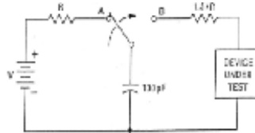                CLASSCLASS:</td><td rowspan=5 colspan=1></td></tr><tr><td rowspan=1 colspan=1>CLASS</td><td rowspan=1 colspan=1>STRES LEVELS</td></tr><tr><td rowspan=1 colspan=1>CLAS5:</td><td rowspan=1 colspan=1>0-1997</td></tr><tr><td rowspan=1 colspan=1>CLAS5 1</td><td rowspan=1 colspan=1>2799-3999V</td></tr><tr><td rowspan=1 colspan=1>CLASS I</td><td rowspan=1 colspan=1>4099-1593/</td></tr><tr><td rowspan=1 colspan=1>8</td><td rowspan=1 colspan=1>Vibration test(with carton)</td><td rowspan=1 colspan=4>Total fixedamplitude:15mmVibration Frequency :10~55HzOne cycle 60 seconds to 3 directions ofX,Y,Z for Each 15 minutes</td><td rowspan=1 colspan=1></td></tr><tr><td rowspan=1 colspan=1>9</td><td rowspan=1 colspan=1>Drop (with carton)</td><td rowspan=1 colspan=4>Height: 60cm1 corner, 3 edges, 6 surfaces</td><td rowspan=1 colspan=1></td></tr></table>

Note: There is no display function NG issue occurred, all the cosmetic specification is judged before the reliability stress.

<table><tr><td rowspan="2">Shenzhen P&O Technology Co.,Limited</td><td>Rev No</td><td>Issued Date.</td><td>Page</td></tr><tr><td>A</td><td>2021.10.7</td><td>9/12</td></tr></table>

## 6.0 OUTINE DIMENSION

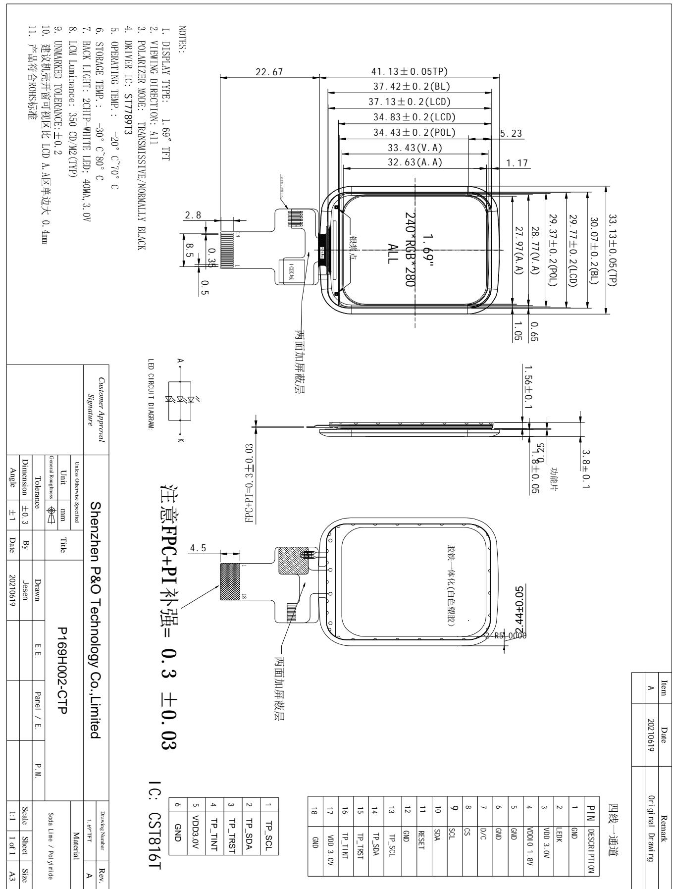

<table><tr><td rowspan=1 colspan=2>四线一通道</td></tr><tr><td rowspan=1 colspan=1>PIN</td><td rowspan=1 colspan=1>DESCRIPTION</td></tr><tr><td rowspan=1 colspan=1>1</td><td rowspan=1 colspan=1>GND</td></tr><tr><td rowspan=1 colspan=1>2</td><td rowspan=1 colspan=1>LEDK</td></tr><tr><td rowspan=1 colspan=1>3</td><td rowspan=1 colspan=1>VDD 3.0V</td></tr><tr><td rowspan=1 colspan=1>4</td><td rowspan=1 colspan=1>VDDI01.8V</td></tr><tr><td rowspan=1 colspan=1>5</td><td rowspan=1 colspan=1>GND</td></tr><tr><td rowspan=1 colspan=1>6</td><td rowspan=1 colspan=1>GND</td></tr><tr><td rowspan=1 colspan=1>7</td><td rowspan=1 colspan=1>D/C</td></tr><tr><td rowspan=1 colspan=1>8</td><td rowspan=1 colspan=1>CS</td></tr><tr><td rowspan=1 colspan=1>9</td><td rowspan=1 colspan=1>SCL</td></tr><tr><td rowspan=1 colspan=1>10</td><td rowspan=1 colspan=1>SDA</td></tr><tr><td rowspan=1 colspan=1>11</td><td rowspan=1 colspan=1>RESET</td></tr><tr><td rowspan=1 colspan=1>12</td><td rowspan=1 colspan=1>GND</td></tr><tr><td rowspan=1 colspan=1>13</td><td rowspan=1 colspan=1>TP_SCL</td></tr><tr><td rowspan=1 colspan=1>14</td><td rowspan=1 colspan=1>TP_SDA</td></tr><tr><td rowspan=1 colspan=1>15</td><td rowspan=1 colspan=1>TP_TRST</td></tr><tr><td rowspan=1 colspan=1>16</td><td rowspan=1 colspan=1>TP_TINT</td></tr><tr><td rowspan=1 colspan=1>17</td><td rowspan=1 colspan=1>VDD 3.0V</td></tr><tr><td rowspan=1 colspan=1>18</td><td rowspan=1 colspan=1>GND</td></tr></table>

<table><tr><td rowspan="2">Shenzhen P&O Technology Co.,Limited</td><td>Rev No</td><td>Issued Date.</td><td>Page</td></tr><tr><td>A</td><td>2021.10.7</td><td>10/12</td></tr></table>

## 7.0 Items and Criteria：

## 7.1 Guarantee

APEX warrants the quality of our products for 1 year (from the date of delivery). If there are functional defects found during the period of warranty, the defective products would be replaced on a one-to-one ba Apex would not be responsible for any direct /indirect liabilities consequential to any parties.

All the products should be stored or used as specified conditions described in these sheets. If module productions are not stored or used as specified conditions, herein, it will be void the 1 year warranty(guarantee).

## 7.2 Visual inspection criterion in cosmetic

(1) Glass defect

<table><tr><td colspan="5">Glass defect</td></tr><tr><td>NO</td><td>Defect</td><td>Criteria</td><td colspan="3">Remark</td></tr><tr><td>1</td><td>Dimension(Minor)</td><td>By engineering diagram</td><td colspan="3">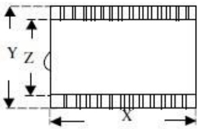</td></tr><tr><td>2</td><td>Cracks(Major)</td><td>Extensive crack 【Reject】</td><td colspan="3">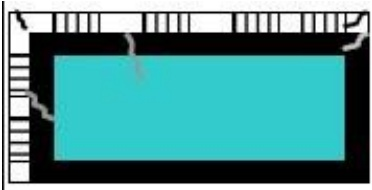</td></tr></table>

(2) LCM appearance defect

<table><tr><td rowspan=1 colspan=1>NO</td><td rowspan=1 colspan=1>Defect</td><td rowspan=1 colspan=2>Criteria</td><td rowspan=1 colspan=1>Remark</td></tr><tr><td rowspan=4 colspan=1>1</td><td rowspan=4 colspan=1>Round type(Minor)</td><td rowspan=1 colspan=1>Spec</td><td rowspan=1 colspan=1>PermissibleQty</td><td rowspan=4 colspan=1>1.ψ=(L+W)/2, L: Length,W: Width2. Disregard if out of A.A.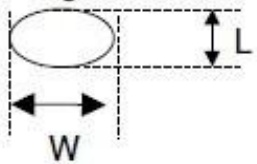</td></tr><tr><td rowspan=1 colspan=1>ψ≤0.10mm</td><td rowspan=1 colspan=1>Disregard</td></tr><tr><td rowspan=1 colspan=1>0.10mm<ψ ≤ 0.20mm</td><td rowspan=1 colspan=1>3</td></tr><tr><td rowspan=1 colspan=1>0.20mm<ψ</td><td rowspan=1 colspan=1>0</td></tr><tr><td rowspan=5 colspan=1>2</td><td rowspan=5 colspan=1>Line type(Minor)</td><td rowspan=1 colspan=1>Spec</td><td rowspan=1 colspan=1>PermissibleQty</td><td rowspan=5 colspan=1>1. L: Length, W: Width2. 1Disregard if out of A.A.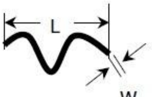W</td></tr><tr><td rowspan=1 colspan=1>W≤0.03mm</td><td rowspan=1 colspan=1>Disregard</td></tr><tr><td rowspan=1 colspan=1>L≤3.0mm and0.03mm<W≤0.05mm</td><td rowspan=1 colspan=1>2</td></tr><tr><td rowspan=1 colspan=1>L≤3.0mm and0.05mm<W≤0.10mm</td><td rowspan=1 colspan=1>1</td></tr><tr><td rowspan=1 colspan=1>W>0.10mm orL>3.0mm</td><td rowspan=1 colspan=1>0</td></tr><tr><td rowspan=1 colspan=1>3</td><td rowspan=1 colspan=1></td><td rowspan=1 colspan=1>Spec.</td><td rowspan=1 colspan=1>PermissibleQty</td><td rowspan=1 colspan=1>1.ψ=(L+W)/2 , L: Length,W: Width</td></tr></table>

<table><tr><td rowspan="2">Shenzhen P&O Technology Co.,Limited</td><td>Rev No</td><td>Issued Date.</td><td>Page</td></tr><tr><td>A</td><td>2021.10.7</td><td>11/12</td></tr></table>

<table><tr><td rowspan=3 colspan=1>Polarizerdent(Minor)</td><td rowspan=1 colspan=1>ψ≤0.20mm</td><td rowspan=1 colspan=1>Disregard</td><td rowspan=3 colspan=1>2.Disregard if out of A.A.</td></tr><tr><td rowspan=1 colspan=1>0.20mm<ψ≤0.30mm</td><td rowspan=1 colspan=1>2</td></tr><tr><td rowspan=1 colspan=1>0.30mm<ψ≤0.50mm</td><td rowspan=1 colspan=1>1</td></tr></table>

(3) FPC

<table><tr><td rowspan=1 colspan=1>NO</td><td rowspan=1 colspan=1>Defect</td><td rowspan=1 colspan=1>Criteria</td><td rowspan=1 colspan=1>Remark</td></tr><tr><td rowspan=1 colspan=1>1</td><td rowspan=1 colspan=1>Copper peeling(Minor)</td><td rowspan=1 colspan=1>Copper peeling                                      【Reject】</td><td rowspan=1 colspan=1></td></tr><tr><td rowspan=1 colspan=1>2</td><td rowspan=1 colspan=1>Golden finger</td><td rowspan=1 colspan=1>FPC golden finger broken, dead fold, indentationmakes FPC surface broken    【Reject】Tin plating layer(or gold plating) scratch, but not hurtcircuit   【Accept】Except circuit, other position scratch but not exposemetal wire    【Accept】</td><td rowspan=1 colspan=1></td></tr><tr><td rowspan=1 colspan=1>3</td><td rowspan=1 colspan=1>Pin</td><td rowspan=1 colspan=1>FPC PI layer delamination    【Reject】Material and color are inconsistent with sample, FPCburrs    【Reject】FPC Pin deformation but not affect function. 【Accept】FPC Pin area is dirty【Reject】Other than FPC Pin area is dirty but not affect function【Accept】</td><td rowspan=1 colspan=1></td></tr><tr><td rowspan=1 colspan=1>4</td><td rowspan=1 colspan=1>Golden finger</td><td rowspan=1 colspan=1>Golden finger edge has burrs,foreign material【Reject】Golden finger oxidation (dark), uneven electroplating,pinhole, foreign material     【Reject】Golden finger soldering pad crack exceeds 1/3 lengthof soldering pad, and soldering pad crack exceed 2Pins【Reject】Golden finger tin plating(or gold plating)scratch, butnot hurt circuit【Accept】Other than golden finger area scratch but not exposemetal circuit   【Accept】</td><td rowspan=1 colspan=1></td></tr><tr><td rowspan=1 colspan=1>5</td><td rowspan=1 colspan=1>FPC Silk printing</td><td rowspan=1 colspan=1>Ghosting, incomplete silk printing, wrong printing【Reject】</td><td rowspan=1 colspan=1></td></tr><tr><td rowspan=1 colspan=1>6</td><td rowspan=1 colspan=1>FPC Circuit line width</td><td rowspan=1 colspan=1>Line width deviation exceed 1/3 line width【Reject】</td><td rowspan=1 colspan=1></td></tr></table>

(4) Black tape

<table><tr><td rowspan=1 colspan=1>NO</td><td rowspan=1 colspan=1>Defect</td><td rowspan=1 colspan=1>Criteria</td><td rowspan=1 colspan=1>Remark</td></tr><tr><td rowspan=1 colspan=1>1</td><td rowspan=1 colspan=1>Shift(Minor)</td><td rowspan=1 colspan=1>IC exposed  【Reject】</td><td rowspan=1 colspan=1></td></tr><tr><td rowspan=1 colspan=1>2</td><td rowspan=1 colspan=1>No black tape(Minor)</td><td rowspan=1 colspan=1>No black tape【Reject】</td><td rowspan=1 colspan=1></td></tr></table>

(5) Silicon

<table><tr><td rowspan=1 colspan=1>NO</td><td rowspan=1 colspan=1>Defect</td><td rowspan=1 colspan=1>Criteria</td><td rowspan=1 colspan=1>Remark</td></tr><tr><td rowspan=1 colspan=1>1</td><td rowspan=1 colspan=1>Amount of silicon(Minor)</td><td rowspan=1 colspan=1>ITO exposed【Reject】</td><td rowspan=1 colspan=1></td></tr></table>

<table><tr><td rowspan="2">Shenzhen P&O Technology Co.,Limited</td><td>Rev No</td><td>Issued Date.</td><td>Page</td></tr><tr><td>A</td><td>2021.10.7</td><td>12/12</td></tr></table>

7.3 Visual inspection criterion in electrical display

<table><tr><td rowspan=1 colspan=1>NO</td><td rowspan=1 colspan=1>Defect</td><td rowspan=1 colspan=3>Criteria</td><td rowspan=4 colspan=1>Remark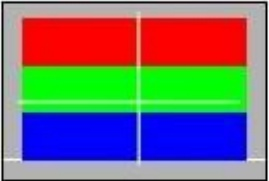</td></tr><tr><td rowspan=1 colspan=1>1</td><td rowspan=1 colspan=1>No display (Major)</td><td rowspan=1 colspan=3>Not allowed</td></tr><tr><td rowspan=1 colspan=1>2</td><td rowspan=1 colspan=1>Missing line (Major)</td><td rowspan=1 colspan=3>Not allowed</td></tr><tr><td rowspan=1 colspan=1>3</td><td rowspan=1 colspan=1>Darker or lighterLine (Major)</td><td rowspan=1 colspan=3>Not allowed</td></tr><tr><td rowspan=1 colspan=1>4</td><td rowspan=1 colspan=1>Weak line(Major)</td><td rowspan=1 colspan=3>By limited sample</td><td rowspan=1 colspan=1></td></tr><tr><td rowspan=3 colspan=1>5</td><td rowspan=3 colspan=1>Bright / Dark point(Minor)</td><td rowspan=1 colspan=1>Spec.</td><td rowspan=1 colspan=2>PermissibleQty</td><td rowspan=3 colspan=1>1:1sub-pixel: 1R or 1G or1B2:Point defect area≥1/2 subpixel.</td></tr><tr><td rowspan=1 colspan=1>Brightpoint</td><td rowspan=1 colspan=2>1</td></tr><tr><td rowspan=1 colspan=1>Darkpoint</td><td rowspan=1 colspan=2>2</td></tr><tr><td rowspan=4 colspan=1>6</td><td rowspan=4 colspan=1>Round type (Minor)</td><td rowspan=1 colspan=2>Spec</td><td rowspan=1 colspan=1>PermissibleQty</td><td rowspan=4 colspan=1>1.ψ=(L+W)/2, L: Length,W: Width2. Disregard if out of A.A.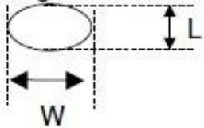</td></tr><tr><td rowspan=1 colspan=2>ψ≤0.10mm</td><td rowspan=1 colspan=1>Disregard</td></tr><tr><td rowspan=1 colspan=2>0.10mm<ψ≤ 0.20mm</td><td rowspan=1 colspan=1>3</td></tr><tr><td rowspan=1 colspan=2>0.20mm<4</td><td rowspan=1 colspan=1>0</td></tr><tr><td rowspan=5 colspan=1>7</td><td rowspan=5 colspan=1>Line type (Minor)</td><td rowspan=1 colspan=2>Spec.</td><td rowspan=1 colspan=1>PermissibleQty</td><td rowspan=5 colspan=1>1. L: Length, W: Width2. Disregard if out of A.A.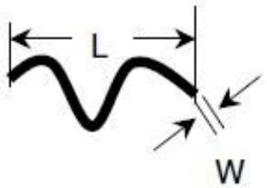</td></tr><tr><td rowspan=1 colspan=2>W≤0.03mm</td><td rowspan=1 colspan=1>Disregard</td></tr><tr><td rowspan=1 colspan=2>L≤3.0mm and0.03mm<W≤0.05mm</td><td rowspan=1 colspan=1>2</td></tr><tr><td rowspan=1 colspan=2>L≤3.0mm and0.05mm<W≤0.10mm</td><td rowspan=1 colspan=1>1</td></tr><tr><td rowspan=1 colspan=2>W>0.10mm           orL>3.0mm</td><td rowspan=1 colspan=1>0</td></tr><tr><td rowspan=1 colspan=1>8</td><td rowspan=1 colspan=1>Mura (Minor)</td><td rowspan=1 colspan=3>By 5% ND filter invisible</td><td rowspan=1 colspan=1></td></tr></table>

